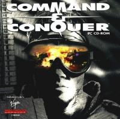

---

## Unlock Music

**Status**:  <span style="background-color: green;color: white">implemented</span>

Unlocks all music tracks that are available in all scenarios, except the main menu music and score screen.

Note: If a track isn't shown, it is not present in the Tiberian Dawn data files you are using.

_Similar behaviour to C&C Gold Patch_

## CLI Options

**Status**: <span style="background-color: yellow;color: black">beta</span>

Show all available CLI options found in the original source code, and add new ones where appropriate. This will be an ongoing task, so it will stay in `beta`.

Run the game with `--help` to see all available options:

```shell
vanillatd --help
```

## Scenario Editor

**Status**: <span style="background-color: red;color: black">alpha</span>

Use the internal Scenario Editor developed by Westwood Studios when building C&C Gold! 

Vanilla Conquer already did some cleanups in this area - the aim is to restore as much original functionality as possible, not to make this a complete editor.

**If you want a fully featured experience use [Mobius Map Editor](https://github.com/Nyerguds/MobiusMapEditor), or if you are feeling retro [CCMAP](https://cnc-comm.com/command-and-conquer/downloads/map-editors/ccmap)/[XCC Editor](https://cnc-comm.com/command-and-conquer/downloads/map-editors/ccmap)**

What works:

- Accessing Editor from main menu (Select `Edit`)
- Adding units/terrain/buildings etc.
- Editing triggers
- Opening existing Scenarios
- Playing the Scenario directly from the Editor (you **must** save when prompted)
- Creating a new Scenario
- Saving Scenario to disk

Bugs:

- Crashes when you attempt to exit the editor
- When you load the editor, Music is loaded and player side units respond with voice lines when selected
  - Music eventually stops (unsure what triggers this)
  - Note: I kind of like this, so might work it into a feature (feels more fun/alive when editing)
