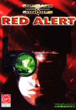
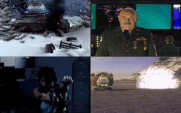

---

## Red Alert: The Lost Files

**Status**: implemented

 

Adds support for `The Lost Files` patch that was supported by the `FunkyFr3sh's` patch for the original game. The game engine now searches for the `xypand*.mix` files included in this patch and searches for the extra video files.

The original patch provides video files in English, German or French. Links below:

- [The Lost Files v3 - English](http://www.mediafire.com/download/4b767436vd2et54/ra_TLF_Videos_v3-en.zip)
- [The Lost Files v3 - German](http://www.mediafire.com/download/xmjdauawp05e5u5/ra_TLF_Videos_v3-de.zip)
- [The Lost Files v3 - French](http://www.mediafire.com/download/pxqluiqaib1g1dc/ra_TLF_Videos_v3-fr.zip)

_Note: Not supported in the Remaster DLL version (It has it's own version of the videos)_
